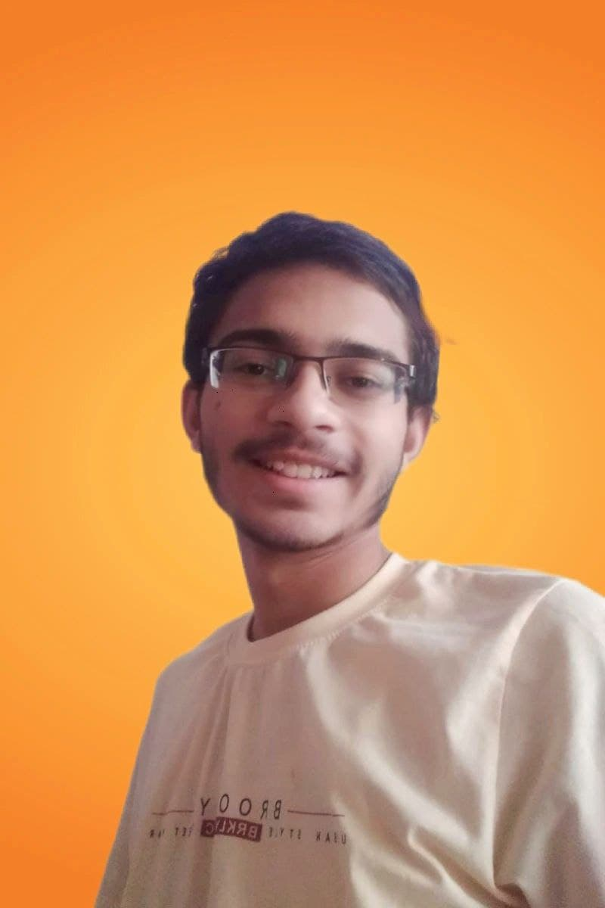

### Hi there, I am Akshat 👋

- 🔭 I’m currently working on Web Development
- 🌱 I’m currently learning: React
- 💬 Ask me about: C++, Competitive Programming
- 📫 How to reach me:through [mail](mailto:akshatnema.official@gmail.com) and [linkedin]()
- 😄 Pronouns: He/him.
- ⚡ Fun fact: I am still a newbie😄.

<!--
**AKSHATNEMA/AKSHATNEMA** is a ✨ _special_ ✨ repository because its `README.md` (this file) appears on your GitHub profile.

Here are some ideas to get you started:

- 🔭 I’m currently working on ...
- 🌱 I’m currently learning ...
- 👯 I’m looking to collaborate on ...
- 🤔 I’m looking for help with ...
- 💬 Ask me about ...
- 📫 How to reach me: ...
- 😄 Pronouns: ...
- ⚡ Fun fact: ...
-->
